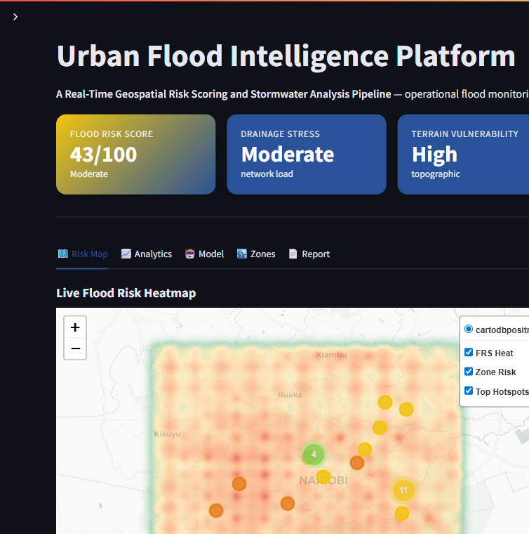
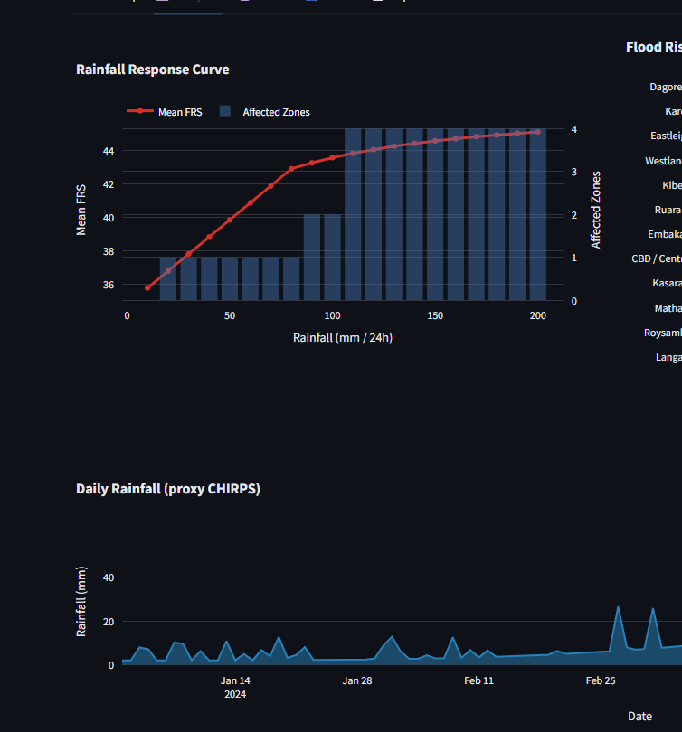
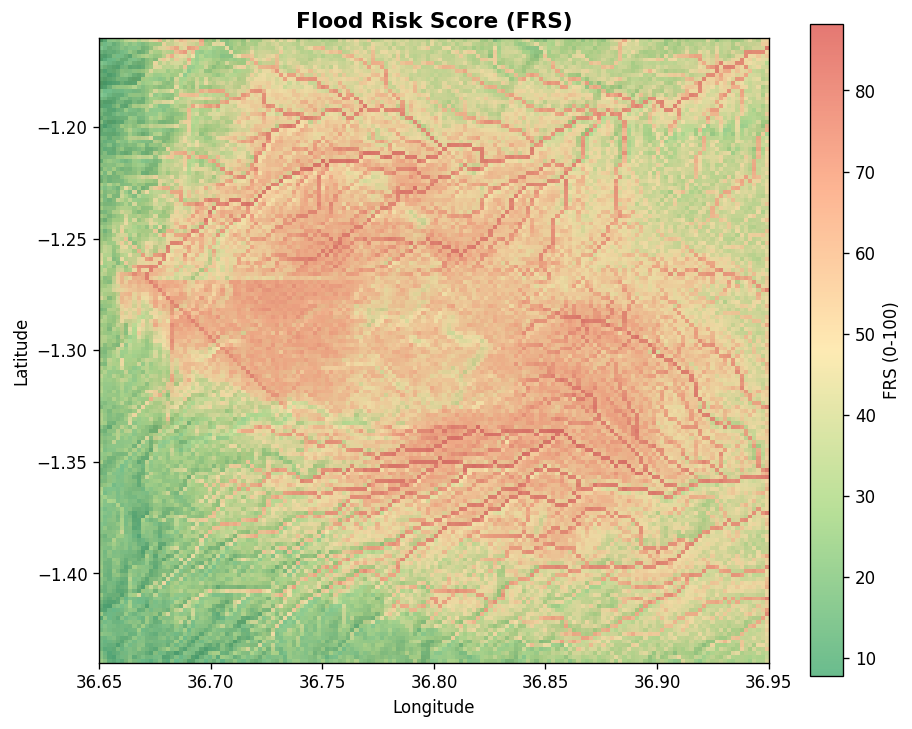
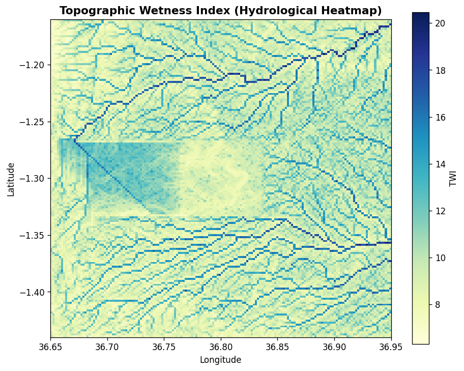

# 🌊 Urban Flood Intelligence Platform

### A Real-Time Geospatial Risk Scoring and Stormwater Analysis Pipeline

> **An operational flood-intelligence system** that a city, disaster-management
> agency or NGO could actually run — not a notebook, but a deployable product.
> It ingests terrain and rainfall data, models flood susceptibility, computes a
> live **Flood Risk Score (0–100)**, and serves it through an interactive
> monitoring dashboard.

<p align="center">
  <b>Study area:</b> Nairobi, Kenya &nbsp;·&nbsp; <b>Signature metric:</b> Flood Risk Score (FRS) &nbsp;·&nbsp; <b>Serving:</b> Streamlit
</p>

<p align="center">
  
  <br/>
  <sub>Operational dashboard — live KPIs and interactive flood-risk heatmap over Nairobi.</sub>
</p>

---

## 1. The operational problem

Nairobi — like many rapidly urbanising cities — suffers recurrent flash
flooding during the *long rains* (Mar–May) and *short rains* (Oct–Dec).
Impervious surfaces, informal settlements in low-lying valleys, and overloaded
stormwater drainage turn heavy downpours into life-threatening events within
hours.

Decision-makers need to answer, **in real time**:

- *Where* will water accumulate for a given rainfall forecast?
- *Which* neighbourhoods cross a critical risk threshold?
- *How* does risk escalate as the storm intensifies?

The Urban Flood Intelligence Platform answers these questions with a single,
interpretable, dynamically-updating metric — the **Flood Risk Score** — backed
by a full terrain-to-dashboard geospatial pipeline.

---

## 2. Signature metric — Flood Risk Score (FRS)

The FRS is the headline operational output, displayed and updated everywhere:

```
────────────────────────────────────────────
  Flood Risk Score      : 82 / 100
  Overall Category      : Severe
  Drainage Stress       : High
  Terrain Vulnerability : Severe
  Affected Zones        : 14 / 12
  Rainfall Intensity    : 150 mm / 24h
────────────────────────────────────────────
```

It blends a **transparent weighted-indicator model** with a **machine-learning
flood-probability surface**, and responds live to rainfall intensity via the
dashboard slider. Categories: **Low · Moderate · High · Severe**.

---

## 3. Architecture at a glance

```
 DEM + Rainfall ─▶ Terrain Engine ─▶ Hydrology Extraction ─▶ Feature Engineering
        │                                                            │
        ▼                                                            ▼
  Interactive Dashboard ◀── Visualization ◀── FRS Engine ◀── Susceptibility Model
```

Full design, module contracts and deployment topology: **[`architecture.md`](architecture.md)**.

---

## 4. Repository structure

```
project-root/
├── data/
│   ├── raw/           # drop real dem.tif / rainfall here (optional)
│   ├── processed/     # pipeline artefacts (npy, csv, parquet)
│   └── external/
├── notebooks/         # 01→06 modular, runnable workflow
│   ├── 01_data_ingestion.ipynb
│   ├── 02_terrain_analysis.ipynb
│   ├── 03_feature_engineering.ipynb
│   ├── 04_model_training.ipynb
│   ├── 05_risk_scoring.ipynb
│   └── 06_dashboard_visualization.ipynb
├── src/               # modular production engines
│   ├── utils.py
│   ├── data_loader.py
│   ├── terrain_analysis.py
│   ├── hydrology.py
│   ├── feature_engineering.py
│   ├── modeling.py
│   ├── risk_scoring.py
│   └── visualization.py
├── scripts/
│   └── run_pipeline.py   # one-command end-to-end run
├── streamlit_app/
│   └── app.py            # deployable intelligence dashboard
├── outputs/
│   ├── maps/          # interactive Folium maps (html)
│   ├── figures/       # static maps + Plotly html
│   ├── reports/       # metrics json + operational summary
│   └── models/        # persisted model
├── README.md
├── architecture.md
└── requirements.txt
```

---

## 5. Quickstart

```bash
# 1) Install dependencies
pip install -r requirements.txt

# 2) (Optional) Fetch REAL data — auto-detected by the pipeline
python scripts/download_dem.py                 # NASA SRTM 30 m  -> data/raw/dem.tif
python scripts/download_rainfall.py            # CHIRPS v2.0     -> data/raw/rainfall.tif

# 3) Run the full pipeline (ingestion → model → scoring → maps → reports)
python scripts/run_pipeline.py                 # reference rainfall
python scripts/run_pipeline.py --rainfall 120  # heavier storm scenario

# 4) Launch the live intelligence dashboard
streamlit run streamlit_app/app.py
```

> **No data to download.** If no real DEM/rainfall raster is found in
> `data/raw`, the platform synthesises a physically-plausible surface for
> Nairobi, so the whole system runs deterministically on a fresh clone.
>
> **Use real SRTM elevation (recommended for Zerve):**
> ```bash
> python scripts/download_dem.py          # streams NASA SRTM 30 m via OpenTopography
> python scripts/run_pipeline.py          # pipeline auto-detects data/raw/dem.tif
> ```
> Direct source: https://opentopography.s3.sdsc.edu/raster/SRTM_GL1/SRTM_GL1_srtm.vrt  
> See [`data/external/sources.md`](data/external/sources.md) for full attribution and mirrors.

---

## 6. Datasets

| Layer | Source (production) | This repo |
| --- | --- | --- |
| Elevation (DEM) | **SRTM GL1 30 m** via [OpenTopography COG VRT](https://opentopography.s3.sdsc.edu/raster/SRTM_GL1/SRTM_GL1_srtm.vrt) | `python scripts/download_dem.py` → `data/raw/dem.tif` (1486–2254 m, verified) |
| Rainfall | **CHIRPS v2.0** ([data.chc.ucsb.edu](https://data.chc.ucsb.edu/products/CHIRPS-2.0/)) | `python scripts/download_rainfall.py` → `data/raw/rainfall.tif`; else orographic field + bimodal daily series |
| Drainage network | OpenStreetMap `waterway` | Steepest-descent stream tracing on the DEM |
| Flood incidents | Emergency-response logs | Elevation-biased synthetic incident points |

The synthetic generators are **not random noise** — they encode Nairobi's real
topographic gradient (western highlands → eastern plains) and rainfall regime,
so the analysis behaves realistically.

---

## 7. Feature-engineering methodology

Six normalised (0–1) **operational flood indicators** are derived from the raw
terrain, hydrology and rainfall layers:

| Indicator | Rationale |
| --- | --- |
| `low_elevation_susceptibility` | Low ground floods first (inverted elevation) |
| `rainfall_intensity` | Normalised rainfall load (drives the live slider) |
| `drainage_stress` | High wetness (TWI) + dense channel network |
| `slope_vulnerability` | Flat ground drains poorly (inverted slope) |
| `runoff_potential` | Upslope contributing area (log flow accumulation) |
| `terrain_instability` | Ruggedness + concave micro-topography |

Where ground-truth flood labels are unavailable, **physically-motivated
synthetic labels** are generated via a logistic response over the weighted
indicators (≈ 25 % positive rate), giving the classifier a genuine, non-trivial
learning task.

---

## 8. Model

Three interpretable classifiers are trained and compared; the best by ROC-AUC is
persisted for scoring:

- **Logistic Regression** — transparent, calibrated baseline (balanced classes)
- **Random Forest** — non-linear, ships feature importances
- **XGBoost** — optional gradient-boosted challenger

Reported diagnostics: **ROC-AUC, F1, accuracy, precision/recall, confusion
matrix, ROC curve, feature importance, classification report**. Emphasis is on
**interpretability and operational usefulness**, not model exotica.

Artefacts land in `outputs/reports/model_metrics.json` and
`outputs/models/flood_model.joblib`.

---

## 9. Risk-scoring logic

```
FRS = 100 · [ (1 − λ)·Σ wᵢ·indicatorᵢ  +  λ·P_model ]
```

- `wᵢ` — indicator weights (sum = 1), in `utils.ScoringConfig`.
- `λ` — ML blend weight, adjustable live (default 0.35).
- Rainfall enters through a **saturating gain** so the FRS escalates realistically
  with storm intensity and rolls up to per-zone scores, categories, affected-zone
  counts and top hotspots.

---

## 10. The dashboard (`streamlit run streamlit_app/app.py`)

A production-style operational console with:

- **Top KPI panels** — Flood Risk Score · Drainage Stress · Terrain
  Vulnerability · Affected Zones · Rainfall Intensity.
- **Interactive controls** — rainfall slider, zone selector, affected-zone
  threshold, ML-blend slider, and a **🛰️ Live monitoring simulation** toggle that
  streams fluctuating rainfall for a real-time feel.
- **Visual panels** — interactive Folium flood-risk heatmap with hotspot &
  zone markers, rainfall-response curve, per-zone risk bars, rainfall
  time-series, feature-importance and model metrics.
- **Outputs** — downloadable Markdown summary report, zone risk table (CSV) and
  hotspot table (CSV).

### Dashboard views

| Operational overview | Analytics |
| --- | --- |
|  |  |

| Flood Risk Score surface | Hydrological wetness (TWI) |
| --- | --- |
|  |  |

Generated assets (after a pipeline run) live in `outputs/`:

- 🗺️ `outputs/maps/flood_risk_map.html` — interactive risk map
- 🖼️ `outputs/figures/frs_map.png` — static FRS surface
- 📊 `outputs/figures/*.html` — ROC, confusion, importance, rainfall response
- 📄 `outputs/reports/operational_summary.md` — one-page operational brief

---

## 11. Reproducibility

- Single global `RANDOM_SEED = 42` drives every stochastic step.
- The pipeline is **idempotent** and **cold-start safe** (regenerates missing
  inputs).
- Heavy dependencies (rasterio, geopandas, folium, xgboost, joblib) are
  **optional** — the core still runs and degrades gracefully.

---

## 12. Future scalability

1. **Live feeds** — swap the synthetic rainfall series for a gauge/forecast API
   (TAHMO, OpenWeather) and schedule the batch layer per new observation.
2. **Real DEM at scale** — increase `grid_size`; hydrology is `O(N log N)`.
3. **Tiled web serving** — export the FRS surface to XYZ raster tiles.
4. **MLOps** — versioned model registry + metric tracking per run.
5. **Alerting** — push notifications when any zone crosses the Severe threshold.

---

## 13. Tech stack

`Python` · `NumPy` · `Pandas` · `SciPy` · `GeoPandas` · `Rasterio` ·
`Rasterstats` · `Shapely` · `scikit-learn` · `XGBoost` · `Folium` · `Plotly` ·
`Matplotlib` · `Streamlit`

---

<p align="center"><i>Built as a deployable urban flood intelligence platform for operational decision-making.</i></p>
